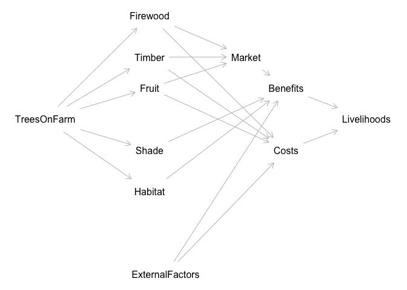

<!-- README.md is generated from README.Rmd. Please edit that file -->

# Hill Climbing as test for causal model

Project Description:

This project aims to build a predictive decision model that connects
causal relationships between planting trees on farms and farmer
livelihoods. The process will unfold in three main steps:

Defining the Problem and Building a Causal Model: The first step
involves engaging experts and utilizing available literature to define
the key causal relationships related to the intervention (e.g., planting
trees on farms). A Directed Acyclic Graph (DAG) will be constructed to
visually represent these relationships, incorporating various factors
like costs, benefits, risks, and their impact on livelihoods.

Creating a Predictive Decision Model Using Expert Elicitation: In this
phase, the causal model will be translated into a Bayesian Network (BN).
Expert elicitation will be used to fill in the Conditional Probability
Tables (CPTs) for each node in the BN, providing the probability
distributions based on expert knowledge and available data.

Testing the Model with Hill Climbing Optimization: Once the Bayesian
Network is constructed, data will be gathered (even if minimal) to test
and refine the model. The hill climbing algorithm will be applied to
optimize the model’s parameters by adjusting them to best fit the
observed data. The optimization process will focus on maximizing the
model’s predictive accuracy and identifying the most likely causal
relationships.

This approach integrates both qualitative insights from experts and
quantitative data, allowing for a robust and adaptable decision model.
The project will leverage causal inference techniques, expert-elicited
probabilities, and optimization algorithms to improve decision-making
for interventions aimed at enhancing livelihoods through agroforestry.

``` r
  source("dagitty_tree_planting.R")
```

<!-- -->

``` r
# Plot the DAG
plot(dag)
```
