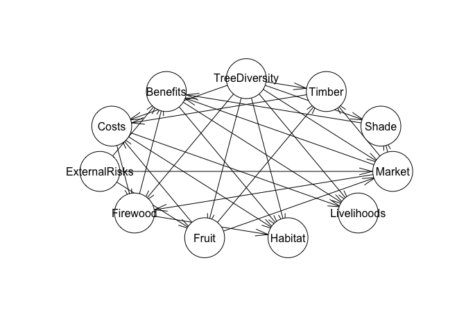

<!-- README.md is generated from README.Rmd. Please edit that file -->

# Hill Climbing as test for causal model

We apply causal inference techniques, expert-elicited probabilities, and
optimization algorithms to improve decision-making for interventions
aimed at enhancing livelihoods through agroforestry. We use a
hill-climbing algorithm to learn the structure of a Bayesian Network
(BN) based on observed data. The observed data contains information from
five publications, each contributing to various factors that may
influence agroforestry systems and livelihoods in different regions. The
goal is to use this data to infer the best network structure that best
explains the dependencies among the variables in the dataset. See the
details in `hill_climbing.R`.

We aim to build a predictive decision model that connects causal
relationships between planting trees on farms and farmer livelihoods.
The process has three main steps: 1. searching available literature to
define the key causal relationships related to planting trees on farms.
A Directed Acyclic Graph (DAG) will be constructed to visually represent
these relationships, incorporating various factors like costs, benefits,
risks, and their impact on livelihoods, 2. the causal model will be
translated into a BN. Literature results will be used to fill in the
Conditional Probability Tables (CPTs) for each node in the BN, providing
the probability distributions based on available data, 3. once the
Bayesian Network is constructed, data will be gathered (even if minimal)
to test and refine the model. The hill climbing algorithm will be
applied to optimize the model’s parameters by adjusting them to best fit
the observed data. The optimization process will focus on maximizing the
model’s predictive accuracy and identifying the most likely causal
relationships. The work demonstrates a robust and adaptable decision
model.

``` r
  source("dagitty_tree_planting.R")
```

<!-- -->

``` r
# Plot the DAG
plot(dag)
```

We build the same graph in `bnlearn` for use in that environment. See
all the custom CPTs in `model_in_bnlearn.R`.

``` r
source("model_in_bnlearn.R")
#> 
#> Attaching package: 'bnlearn'
#> The following objects are masked from 'package:dagitty':
#> 
#>     ancestors, children, descendants, parents, spouses
#> Probability of improved livelihoods given trees on farm:  0.6901063
plot(network_structure)
```

<!-- -->

## Perform inference

Calculate the probability of “Livelihoods” being “Improved” given “Trees
on Farm”.

``` r
cpquery(bn_fitted, event = (Livelihoods == "Improved"), evidence = (TreesOnFarm == "Yes"))
#> [1] 0.7102147
```

To validate our Bayesian Network, we can perform several tests to ensure
that the model behaves as expected and that the conditional dependencies
between the nodes are correctly represented.

### Test for inconsistent Evidence

Here we introduce evidence that contradicts the CPTs to check for the
system response. A node conditioned on one state `TreesOnFarm == "No"`,
but the evidence `Firewood == "Yes"` conflicts with that, it should
return a very low or zero probability (for each iteration of the model).

``` r
cpquery(bn_fitted, event = (TreesOnFarm == "No"), evidence = (Firewood == "Yes"))
#> [1] 0.01442716
```

This tests the model’s behavior when evidence contradicts the dependency
structure.

### Query for Node Probabilities

Test the probability distributions of individual nodes given various
evidence. For example, given evidence for Market, check the conditional
probability distribution for Livelihoods.

Example for Livelihoods:

``` r
cpquery(bn_fitted, event = (Livelihoods == "Improved"), evidence = (Benefits == "High"))
#> [1] 0.7365746
```

This should return the probability of improved livelihoods given that
the market is high.

### Sensitivity Analysis

Perform a sensitivity analysis to understand how changes in one or more
variables affect the results. For example, change the probability of
Firewood or Timber and see how it affects the probability of
Livelihoods.

``` r
cpquery(bn_fitted, event = (Livelihoods == "Improved"), evidence = (Timber == "Yes"))
#> [1] 0.6726038
```

### Simulation and Comparison with Expected Results

Generate synthetic data based on the network structure and compare it
with expected or known results.

``` r
# Simulate 1000 samples
simulated_data <- rbn(bn_fitted, n = 1000)
head(simulated_data)
#>   Benefits Costs ExternalRisks Firewood Fruit Habitat  Livelihoods Market Shade
#> 1      Low  High          High       No    No     Yes Not Improved   High   Yes
#> 2     High   Low          High       No   Yes     Yes     Improved   High    No
#> 3     High   Low          High      Yes   Yes     Yes Not Improved   High   Yes
#> 4      Low   Low          High       No   Yes     Yes Not Improved   High    No
#> 5     High   Low          High       No    No      No     Improved   High   Yes
#> 6     High  High          High       No    No      No     Improved   High    No
#>   Timber TreesOnFarm
#> 1    Yes          No
#> 2    Yes          No
#> 3     No         Yes
#> 4    Yes         Yes
#> 5    Yes          No
#> 6    Yes          No
```

Calculate the observed distribution of ‘Livelihoods’.

``` r
observed_Livelihoods <- table(simulated_data$Livelihoods) / nrow(simulated_data)

observed_Livelihoods
#> 
#>     Improved Not Improved 
#>        0.683        0.317
```

Save the expectation for ‘Livelihoods’.

``` r
expected_Livelihoods <- c("Improved" = 0.7, "Not Improved" = 0.3)
```

Compare the observed distribution with the expected one.

``` r
data.frame(
  "Observed" = observed_Livelihoods,
  "Expected" = expected_Livelihoods
)
#>              Observed.Var1 Observed.Freq Expected
#> Improved          Improved         0.683      0.7
#> Not Improved  Not Improved         0.317      0.3
```

Calculate the distribution of ‘Timber’ given ‘TreesOnFarm’ (example for
other node relationships too).

``` r
table(simulated_data$Timber, simulated_data$TreesOnFarm) / nrow(simulated_data)
#>      
#>         Yes    No
#>   Yes 0.411 0.495
#>   No  0.086 0.008
```

Visualize Livelihoods results.

``` r
library(ggplot2)

ggplot(simulated_data, aes(x = Livelihoods)) +
  geom_bar(aes(y = after_stat(prop)), stat = "count") +
  scale_y_continuous(labels = scales::percent) +
  ggtitle("Distribution of Livelihoods in Simulated Data")
```

<!-- -->

### Hill-climbing algorithm

Learn the structure of a Bayesian network using a hill-climbing
algorithm `hc`.

The observations for the are based on reports from 5 publications:

- “Agroforestry for Sustainable Development: Evidence from Smallholder
  Farms in Sub-Saharan Africa” (FAO Report): data about tree planting
  systems, timber, firewood, fruit, and market access in Sub-Saharan
  Africa. insight into whether these systems are beneficial and whether
  they are contributing to improved livelihoods.

- “Impact of Agroforestry Systems on Livelihoods: A Case Study in
  Central India”: data on how agroforestry affects the livelihoods of
  smallholder farmers, including income from timber, firewood, and fruit
  production.

- “The Role of Agroforestry in Climate Change Adaptation and Mitigation”
  (IPCC Report): data on external risks such as climate change, and how
  different agroforestry systems mitigate these risks
  `fill the "ExternalRisks" column`

- “Socioeconomic Impacts of Agroforestry on Farmers: A Longitudinal
  Study”: detailed information on market access, income sources (such as
  timber, firewood, and fruit), and how these affect costs and benefits

- “Agroforestry and Sustainable Land Management: A Study in Southeast
  Asia”: insight into the habitat services provided by agroforestry,
  such as biodiversity, as well as its economic impacts

``` r
# Example with hill climbing (using bnlearn)
library(bnlearn)
```

We used the score-based structure learning algorithm from `bnlearn` to
learn the structure of a Bayesian network using a hill-climbing
algorithm. We used the observed data from the 5 papers with some missing
values (NA) for unobserved nodes.

``` r
observed_data <- data.frame(
  TreesOnFarm = c("Yes", "No", "Yes", "Yes", "Yes"),
  Timber = c("Yes", "No", "Yes", "No", "Yes"),
  Firewood = c("Yes", NA, "No", "Yes", NA),
  Fruit = c("No", "No", NA, "No", "Yes"),
  Market = c(NA, "High", "High", "Low", "High"),
  Shade = c("Yes", "No", "Yes", NA, "No"),
  Habitat = c("Yes", NA, "No", "Yes", "No"),
  ExternalRisks = c("Low", "High", "High", "Low", "Low"),
  Costs = c("High", "Low", "Low", NA, "High"),
  Benefits = c("Low", "High", "Low", "High", NA),
  Livelihoods = c(NA, "Improved", "Improved", "Not Improved", "Improved")
)
```

Convert all the character columns from our observations into factors for
the hill climbing.

``` r

# Convert character columns to factors
observed_data$TreesOnFarm <- as.factor(observed_data$TreesOnFarm)
observed_data$Timber <- as.factor(observed_data$Timber)
observed_data$Firewood <- as.factor(observed_data$Firewood)
observed_data$Fruit <- as.factor(observed_data$Fruit)
observed_data$Market <- as.factor(observed_data$Market)
observed_data$Shade <- as.factor(observed_data$Shade)
observed_data$Habitat <- as.factor(observed_data$Habitat)
observed_data$ExternalRisks <- as.factor(observed_data$ExternalRisks)
observed_data$Costs <- as.factor(observed_data$Costs)
observed_data$Benefits <- as.factor(observed_data$Benefits)
observed_data$Livelihoods <- as.factor(observed_data$Livelihoods)
```

Plot the fitted model with the data from the papers only.

``` r
source("model_in_bnlearn.R")
#> Probability of improved livelihoods given trees on farm:  0.7053481
# x in hc = the observations alone
fitted_model <- hc(observed_data)
plot(fitted_model)
```

<!-- -->

Plot the model based on both our model structure and the literature when
we use the original network structure as a `start`. This is a `class bn`
object. It shows DAG and we use it to initialize the `hc` algorithm.

``` r
# x in hc = the observations 
# start = the original network structure 
hill_climbing_model <- hc(x= observed_data, start = network_structure)
plot(hill_climbing_model)
```

<!-- -->
