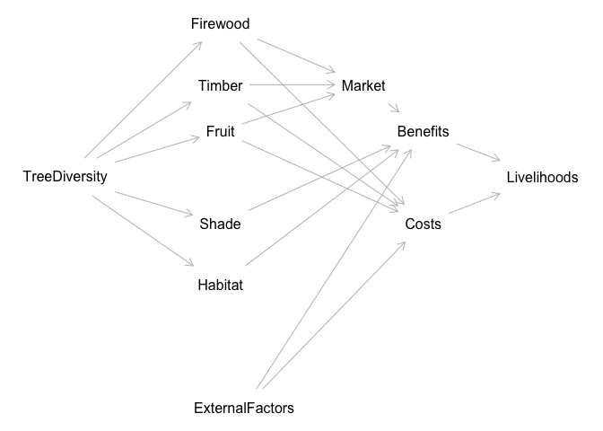

<!-- README.md is generated from README.Rmd. Please edit that file -->

# Hill Climbing as test for causal model

We apply causal inference techniques, expert-elicited probabilities, and
optimization algorithms, to improve decision-making for interventions
aimed at enhancing livelihoods through agroforestry. We use a
hill-climbing algorithm to learn the structure of a Bayesian Network
(BN) based on observed data. The observed data contains information from
five publications, each contributing to various factors that may
influence agroforestry systems and livelihoods in different regions. The
goal is to use this data to infer the best network structure that best
explains the dependencies among the variables in the dataset. See the
details in `hill_climbing.R`.

We aim to build a predictive decision model that connects causal
relationships between planting trees on farms and farmer livelihoods.
The process has three main steps: 1. searching available literature to
define the key causal relationships related to planting trees on farms.
A Directed Acyclic Graph (DAG) will be constructed to visually represent
these relationships, incorporating various factors like costs, benefits,
risks, and their impact on livelihoods, 2. the causal model will be
translated into a BN. Literature results will be used to fill in the
Conditional Probability Tables (CPTs) for each node in the BN, providing
the probability distributions based on available data, 3. once the
Bayesian Network is constructed, data will be gathered (even if minimal)
to test and refine the model. The hill climbing algorithm will be
applied to optimize the model’s parameters by adjusting them to best fit
the observed data. The optimization process will focus on maximizing the
model’s predictive accuracy and identifying the most likely causal
relationships. The work demonstrates a robust and adaptable decision
model.

``` r
  source("dagitty_tree_planting.R")
```

<!-- -->

``` r
# Plot the DAG
plot(dag)
```

We build the same graph in `bnlearn` for use in that environment. See
all the custom CPTs in `model_in_bnlearn.R`.

``` r
source("model_in_bnlearn.R")
#> 
#> Attaching package: 'bnlearn'
#> The following objects are masked from 'package:dagitty':
#> 
#>     ancestors, children, descendants, parents, spouses
#> Probability of improved livelihoods given trees on farm:  0
plot(network_structure)
```

<!-- -->

## Perform inference

Calculate the probability of “Livelihoods” being “Improved” given “Trees
on Farm”.

``` r
cpquery(bn_fitted, event = (Livelihoods == "Improved"), evidence = (TreeDiversity == "Yes"))
#> [1] 0
```

To validate our Bayesian Network, we can perform several tests to ensure
that the model behaves as expected and that the conditional dependencies
between the nodes are correctly represented.

### Test for inconsistent Evidence

Here we introduce evidence that contradicts the dependency structure to
check for the system response. A node conditioned on one state
`TreeDiversity == "No"`, but the evidence `Firewood == "Yes"` conflicts
with `bn_fitted`, it should return a very low or zero probability (for
each iteration of the model).

``` r
cpquery(bn_fitted, event = (TreeDiversity == "No"), evidence = (Firewood == "Yes"))
#> [1] 0
```

### Query for Node Probabilities

Test the probability distributions of individual nodes given various
evidence. For example, given evidence for Market, check the conditional
probability distribution for Livelihoods.

Example for Livelihoods:

``` r
cpquery(bn_fitted, event = (Livelihoods == "Improved"), evidence = (Benefits == "High"))
#> [1] 0.7109233
```

This should return the probability of improved livelihoods given that
the market is high.

### Sensitivity Analysis

Perform a sensitivity analysis to understand how changes in one or more
variables affect the results. For example, change the probability of
Firewood or Timber and see how it affects the probability of
Livelihoods.

``` r
cpquery(bn_fitted, event = (Livelihoods == "Improved"), evidence = (Timber == "Yes"))
#> [1] 0.6789298
```

### Simulation and Comparison with Expected Results

Generate synthetic data based on the network structure and compare it
with expected or known results.

``` r
# Simulate 1000 samples
simulated_data <- rbn(bn_fitted, n = 1000)
head(simulated_data)
#>   Benefits Costs ExternalRisks Firewood Fruit Habitat  Livelihoods Market Shade
#> 1      Low  High          High      Yes    No     Yes     Improved    Low    No
#> 2     High  High          High      Yes   Yes     Yes     Improved   High   Yes
#> 3     High   Low          High      Yes   Yes     Yes     Improved   High   Yes
#> 4     High  High           Low      Yes   Yes     Yes     Improved   High    No
#> 5     High  High          High       No   Yes     Yes     Improved   High    No
#> 6     High   Low          High      Yes    No     Yes Not Improved   High    No
#>   Timber TreeDiversity
#> 1     No          High
#> 2    Yes          High
#> 3     No          High
#> 4    Yes          High
#> 5    Yes          High
#> 6    Yes          High
```

Calculate the observed distribution of ‘Livelihoods’.

``` r
observed_Livelihoods <- table(simulated_data$Livelihoods) / nrow(simulated_data)

observed_Livelihoods
#> 
#>     Improved Not Improved 
#>        0.659        0.341
```

Save the expectation for ‘Livelihoods’.

``` r
expected_Livelihoods <- c("Improved" = 0.7, "Not Improved" = 0.3)
```

Compare the observed distribution with the expected one.

``` r
data.frame(
  "Observed" = observed_Livelihoods,
  "Expected" = expected_Livelihoods
)
#>              Observed.Var1 Observed.Freq Expected
#> Improved          Improved         0.659      0.7
#> Not Improved  Not Improved         0.341      0.3
```

Calculate the distribution of ‘Timber’ given ‘TreeDiversity’ (example
for other node relationships too).

``` r
table(simulated_data$Timber, simulated_data$TreeDiversity) / nrow(simulated_data)
#>      
#>        High   Low
#>   Yes 0.394 0.500
#>   No  0.098 0.008
```

Visualize Livelihoods results.

``` r
library(ggplot2)

ggplot(simulated_data, aes(x = Livelihoods)) +
  geom_bar(aes(y = after_stat(prop)), stat = "count") +
  scale_y_continuous(labels = scales::percent) +
  ggtitle("Distribution of Livelihoods in Simulated Data")
```

<!-- -->

### Hill-climbing algorithm

Learn the structure of a Bayesian network using a hill-climbing
algorithm `hc`.

The observations for the are based on reports from the literature:

Agroforestry introduces both initial and ongoing costs, including
planting, labor, and pruning, which can constrain adoption, particularly
for resource-poor farmers. External factors, such as market access,
extension services, and credit availability, significantly influence
these costs, as demonstrated in studies on farmer-managed natural
regeneration in Niger (Haglund et al. (2011)) and agroforestry practices
in sloping lands of Asia and the Pacific (Craswell et al. (1997)).
Bureaucratic inefficiencies and limited market alternatives also add to
these challenges (Akter et al. (2022)).

Despite the costs, agroforestry provides substantial benefits to
farmers. It enhances access to food, timber, fuelwood, and fodder,
directly improving livelihood capitals, as observed in tropical moist
forests in Bangladesh (Akter et al. (2022)). Agroforestry supports
biodiversity conservation, soil fertility, and carbon sequestration,
making it a key strategy for climate change mitigation and adaptation in
Sub-Saharan Africa (Verchot et al. (2007); Bogale and Bekele (2023)). In
Ethiopia, smallholder farmers benefit from improved productivity and
diversified income streams through agroforestry (Amare et al. (2019)),
while in Kenya, agroforestry has bolstered household food security,
particularly in regions prone to wildlife crop raiding (Quandt (2021)).
Agroforestry systems also provide resilience to environmental stressors
by diversifying income sources and creating favorable microclimates
(Ngango et al. (2024); Bishaw (2013)).

However, agroforestry is not without risks. Farmers face challenges such
as reduced crop yields due to competition for water, nutrients, and
light, as well as exposure to fluctuating market conditions (Do et al.
(2024); Akter et al. (2022)). These risks are compounded by adoption
barriers, including insecure land tenure and lack of institutional
support (Hughes et al. (2020); Johansson, Axelsson, and Kimanzu (2013)).

The interplay of costs, benefits, and risks ultimately determines the
impact of agroforestry on livelihoods. While high costs and risks can
hinder adoption and sustainability, the benefits—such as increased
resilience, economic returns, and ecosystem services—can offset these
challenges (Quandt (2021); Awazi and Avana-Tientcheu (2020)). External
factors like cooperative memberships and extension services
significantly shape the outcomes of agroforestry systems (Ngango et al.
(2024); Bishaw (2013)).

Empirical evidence underscores these dynamics. Research in Bangladesh
highlights agroforestry’s positive impacts on livelihoods despite
systemic inefficiencies (Akter et al. (2022)), while studies in Ethiopia
and Kenya demonstrate agroforestry’s role in reducing livelihood risks
and enhancing resilience to environmental stressors (Amare et al.
(2019); Bishaw (2013)). In Cameroon, agroforestry has been shown to
mitigate farmer–grazier conflicts, promoting social and economic
stability (Awazi and Avana-Tientcheu (2020)). Similarly, agroforestry
practices in Tanzania reveal that social and ecological factors, such as
tree survival rates and community perceptions, influence the
sustainability of these systems (Johansson, Axelsson, and Kimanzu
(2013)).

Agroforestry’s potential to address multiple livelihood and
environmental challenges is clear, but its success depends on targeted
policy interventions to reduce costs, mitigate risks, and enhance
benefits, ensuring equitable access and scalability across diverse
contexts.

``` r
# Example with hill climbing (using bnlearn)
library(bnlearn)
```

We used the score-based structure learning algorithm from `bnlearn` to
learn the structure of a Bayesian network using a hill-climbing
algorithm. We used the observed data from the 5 papers with some missing
values (NA) for unobserved nodes.

``` r
source("data/observed_data.R")
observed_data
#>    TreeDiversity Timber Firewood Fruit Market Shade Habitat ExternalRisks Costs
#> 1           High    Yes      Yes   Yes   High   Yes     Yes          High  High
#> 2            Low    Yes       No    No   <NA>  <NA>     Yes           Low   Low
#> 3            Low     No      Yes    No   High   Yes      No          High  High
#> 4           High    Yes      Yes   Yes    Low   Yes     Yes           Low  High
#> 5           High    Yes       No    No   High   Yes      No          High  <NA>
#> 6            Low    Yes      Yes   Yes   High   Yes     Yes          High   Low
#> 7            Low     No      Yes    No    Low    No     Yes           Low  High
#> 8           High    Yes       No   Yes   High   Yes     Yes           Low   Low
#> 9            Low    Yes      Yes  <NA>   High  <NA>     Yes          High  High
#> 10          High    Yes      Yes   Yes    Low   Yes      No          High   Low
#> 11           Low    Yes      Yes  <NA>   High   Yes     Yes           Low  High
#> 12          High     No      Yes    No   High   Yes     Yes          High  High
#> 13          High    Yes      Yes   Yes   High   Yes     Yes           Low  High
#>    Benefits  Livelihoods
#> 1      High     Improved
#> 2       Low     Improved
#> 3      High Not Improved
#> 4      High     Improved
#> 5      High     Improved
#> 6      High Not Improved
#> 7       Low     Improved
#> 8      High Not Improved
#> 9       Low     Improved
#> 10     High Not Improved
#> 11      Low     Improved
#> 12     High     Improved
#> 13      Low     Improved
```

Convert all the character columns from our observations into factors for
the hill climbing.

``` r

# Convert character columns to factors
observed_data$TreeDiversity <- as.factor(observed_data$TreeDiversity)
observed_data$Timber <- as.factor(observed_data$Timber)
observed_data$Firewood <- as.factor(observed_data$Firewood)
observed_data$Fruit <- as.factor(observed_data$Fruit)
observed_data$Market <- as.factor(observed_data$Market)
observed_data$Shade <- as.factor(observed_data$Shade)
observed_data$Habitat <- as.factor(observed_data$Habitat)
observed_data$ExternalRisks <- as.factor(observed_data$ExternalRisks)
observed_data$Costs <- as.factor(observed_data$Costs)
observed_data$Benefits <- as.factor(observed_data$Benefits)
observed_data$Livelihoods <- as.factor(observed_data$Livelihoods)
```

Plot the fitted model with the data from the papers only.

``` r
source("model_in_bnlearn.R")
#> Probability of improved livelihoods given trees on farm:  0
# x in hc = the observations alone
fitted_model <- hc(observed_data)
plot(fitted_model)
```

<!-- -->

Plot the model based on both our model structure and the literature when
we use the original network structure as a `start`. This is a `class bn`
object. It shows DAG and we use it to initialize the `hc` algorithm.

``` r
# x in hc = the observations 
# start = the original network structure 
hill_climbing_model <- hc(x= observed_data, start = network_structure)
plot(hill_climbing_model)
```

<!-- -->

# References

<div id="refs" class="references csl-bib-body hanging-indent"
entry-spacing="0">

<div id="ref-akter_agroforestry_2022" class="csl-entry">

Akter, Rojina, Mohammad Kamrul Hasan, Khondokar H. Kabir, Dietrich Darr,
and Nasima Akter Roshni. 2022. “Agroforestry Systems and Their Impact on
Livelihood Improvement of Tribal Farmers in a Tropical Moist Deciduous
Forest in Bangladesh.” *Trees, Forests and People* 9 (September):
100315. <https://doi.org/10.1016/j.tfp.2022.100315>.

</div>

<div id="ref-amare_agroforestry_2019" class="csl-entry">

Amare, Dagninet, Menale Wondie, Wolde Mekuria, and Dietrich Darr. 2019.
“Agroforestry of Smallholder Farmers in Ethiopia: Practices and
Benefits.” *Small-Scale Forestry* 18 (1): 39–56.
<https://doi.org/10.1007/s11842-018-9405-6>.

</div>

<div id="ref-awazi_agroforestry_2020" class="csl-entry">

Awazi, Nyong Princely, and Marie-Louise Avana-Tientcheu. 2020.
“Agroforestry as a Sustainable Means to Farmer–Grazier Conflict
Mitigation in Cameroon.” *Agroforestry Systems* 94 (6): 2147–65.
<https://doi.org/10.1007/s10457-020-00537-y>.

</div>

<div id="ref-bishaw_farmers_2013" class="csl-entry">

Bishaw, Badege. 2013. *Farmers’ Strategies for Adapting to Mitigating
Climate Variability and Change Through Agroforestry in Ethiopia and
Kenya*.

</div>

<div id="ref-bogale_sustainability_2023" class="csl-entry">

Bogale, Girma Asefa, and Solomon Estifanos Bekele. 2023. “Sustainability
of Agroforestry Practices and Their Resilience to Climate Change
Adaptation and Mitigation in Sub-Saharan Africa: A Review.” *Ekológia
(Bratislava)* 42 (2): 179–92. <https://doi.org/10.2478/eko-2023-0021>.

</div>

<div id="ref-craswell_agroforestry_1997" class="csl-entry">

Craswell, E. T., A. Sajjapongse, D. J. B. Howlett, and A. J. Dowling.
1997. “Agroforestry in the Management of Sloping Lands in Asia and the
Pacific.” *Agroforestry Systems* 38 (1): 121–37.
<https://doi.org/10.1023/A:1005960612386>.

</div>

<div id="ref-do_adapting_2024" class="csl-entry">

Do, Hoa, Cory Whitney, Nguyen La, Hugo Storm, and Eike Luedeling. 2024.
“Adapting Agroforestry to Upland Farming Systems: Narratives from
Smallholder Farmers in Northwest Vietnam.” *Agronomy for Sustainable
Development* 44 (2): 17. <https://doi.org/10.1007/s13593-024-00954-8>.

</div>

<div id="ref-haglund_dry_2011" class="csl-entry">

Haglund, Eric, Jupiter Ndjeunga, Laura Snook, and Dov Pasternak. 2011.
“Dry Land Tree Management for Improved Household Livelihoods: Farmer
Managed Natural Regeneration in Niger.” *Journal of Environmental
Management* 92 (7): 1696–1705.
<https://doi.org/10.1016/j.jenvman.2011.01.027>.

</div>

<div id="ref-hughes_assessing_2020" class="csl-entry">

Hughes, Karl, Seth Morgan, Katherine Baylis, Judith Oduol, Emilie
Smith-Dumont, Tor-Gunnar Vågen, and Hilda Kegode. 2020. “Assessing the
Downstream Socioeconomic Impacts of Agroforestry in Kenya.” *World
Development* 128 (April): 104835.
<https://doi.org/10.1016/j.worlddev.2019.104835>.

</div>

<div id="ref-johansson_mapping_2013" class="csl-entry">

Johansson, Karl-Erik, Robert Axelsson, and Ngolia Kimanzu. 2013.
“Mapping the Relationship of Inter-Village Variation in Agroforestry
Tree Survival with Social and Ecological Characteristics: The Case of
the Vi Agroforestry Project, Mara Region, Tanzania.” *Sustainability* 5
(12): 5171–94. <https://doi.org/10.3390/su5125171>.

</div>

<div id="ref-ngango_does_2024" class="csl-entry">

Ngango, Jules, Edouard Musabanganji, Aristide Maniriho, Ferdinand
Nkikabahizi, Anitha Mukamuhire, and John N. Ng’ombe. 2024. “Does
Agroforestry Contribute to Household Food Security? A Micro-Perspective
from Southern Rwanda.” *Forest Policy and Economics* 165 (August):
103252. <https://doi.org/10.1016/j.forpol.2024.103252>.

</div>

<div id="ref-quandt_agroforestry_2021" class="csl-entry">

Quandt, Amy. 2021. “Agroforestry Trees for Improved Food Security on
Farms Impacted by Wildlife Crop Raiding in Kenya.” *Trees, Forests and
People* 4 (June): 100069. <https://doi.org/10.1016/j.tfp.2021.100069>.

</div>

<div id="ref-verchot_climate_2007" class="csl-entry">

Verchot, Louis V., Meine Van Noordwijk, Serigne Kandji, Tom Tomich, Chin
Ong, Alain Albrecht, Jens Mackensen, Cynthia Bantilan, K. V. Anupama,
and Cheryl Palm. 2007. “Climate Change: Linking Adaptation and
Mitigation Through Agroforestry.” *Mitigation and Adaptation Strategies
for Global Change* 12 (5): 901–18.
<https://doi.org/10.1007/s11027-007-9105-6>.

</div>

</div>
