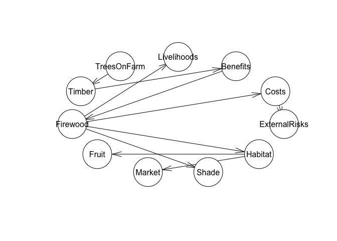

<!-- README.md is generated from README.Rmd. Please edit that file -->

# Hill Climbing as test for causal model

Project Description:

This project aims to build a predictive decision model that connects
causal relationships between planting trees on farms and farmer
livelihoods. The process will unfold in three main steps:

Defining the Problem and Building a Causal Model: The first step
involves engaging experts and utilizing available literature to define
the key causal relationships related to the intervention (e.g., planting
trees on farms). A Directed Acyclic Graph (DAG) will be constructed to
visually represent these relationships, incorporating various factors
like costs, benefits, risks, and their impact on livelihoods.

Creating a Predictive Decision Model Using Expert Elicitation: In this
phase, the causal model will be translated into a Bayesian Network (BN).
Expert elicitation will be used to fill in the Conditional Probability
Tables (CPTs) for each node in the BN, providing the probability
distributions based on expert knowledge and available data.

Testing the Model with Hill Climbing Optimization: Once the Bayesian
Network is constructed, data will be gathered (even if minimal) to test
and refine the model. The hill climbing algorithm will be applied to
optimize the model’s parameters by adjusting them to best fit the
observed data. The optimization process will focus on maximizing the
model’s predictive accuracy and identifying the most likely causal
relationships.

This approach integrates both qualitative insights from experts and
quantitative data, allowing for a robust and adaptable decision model.
The project will leverage causal inference techniques, expert-elicited
probabilities, and optimization algorithms to improve decision-making
for interventions aimed at enhancing livelihoods through agroforestry.

``` r
  source("dagitty_tree_planting.R")
```

<!-- -->

``` r
# Plot the DAG
plot(dag)
```

We build the same graph in `bnlearn` for use in that environment. See
all the custom CPTs in `model_in_bnlearn.R`.

``` r
source("model_in_bnlearn.R")
#> 
#> Attaching package: 'bnlearn'
#> The following objects are masked from 'package:dagitty':
#> 
#>     ancestors, children, descendants, parents, spouses
#> Probability of improved livelihoods given trees on farm:  0.692138
plot(network_structure)
```

<!-- -->

## Perform inference

Calculate the probability of “Livelihoods” being “Improved” given “Trees
on Farm”.

``` r
inference_result <- cpquery(bn_fitted, event = (Livelihoods == "Improved"), evidence = (TreesOnFarm == "Yes"))

cat("Probability of improved livelihoods given trees on farm: ", inference_result, "\n")
#> Probability of improved livelihoods given trees on farm:  0.7094287
```

To validate our Bayesian Network, we can perform several tests to ensure
that the model behaves as expected and that the conditional dependencies
between the nodes are correctly represented.

### Inconsistent Evidence

Try introducing evidence that contradicts the CPTs and check for the
system’s response. For example, if a node is conditioned on one state,
but the evidence conflicts with that, it should return a very low or
zero probability.

``` r
inconsistent_inference <- cpquery(bn_fitted, event = (TreesOnFarm == "No"), evidence = (Firewood == "Yes"))

inconsistent_inference
#> [1] 0.01186776
```

This tests the model’s behavior when evidence contradicts the dependency
structure.

### Query for Node Probabilities

Test the probability distributions of individual nodes given various
evidence. For example, given evidence for Market, check the conditional
probability distribution for Livelihoods.

Example for Livelihoods:

``` r
inference_Livelihoods <- cpquery(bn_fitted, event = (Livelihoods == "Improved"), evidence = (Benefits == "High"))

inference_Livelihoods
#> [1] 0.7245798
```

This should return the probability of improved livelihoods given that
the market is high.

### Sensitivity Analysis

Perform a sensitivity analysis to understand how changes in one or more
variables affect the results. For example, change the probability of
Firewood or Timber and see how it affects the probability of
Livelihoods.

``` r
sensitivity_analysis <- cpquery(bn_fitted, event = (Livelihoods == "Improved"), evidence = (Timber == "Yes"))

sensitivity_analysis
#> [1] 0.6726867
```

### Simulation and Comparison with Expected Results

Generate synthetic data based on our network structure and compare it
with expected or known results.

``` r
# Simulate 1000 samples
simulated_data <- rbn(bn_fitted, n = 1000)
head(simulated_data)
#>   Benefits Costs ExternalRisks Firewood Fruit Habitat  Livelihoods Market Shade
#> 1     High  High          High      Yes    No     Yes Not Improved   High    No
#> 2     High  High          High       No    No     Yes     Improved    Low    No
#> 3     High  High           Low       No   Yes      No     Improved   High   Yes
#> 4      Low  High           Low      Yes    No     Yes     Improved    Low   Yes
#> 5     High  High          High       No    No      No     Improved   High   Yes
#> 6     High  High          High       No    No     Yes Not Improved   High   Yes
#>   Timber TreesOnFarm
#> 1    Yes         Yes
#> 2    Yes         Yes
#> 3    Yes          No
#> 4    Yes         Yes
#> 5    Yes          No
#> 6    Yes         Yes
```

Calculate the observed distribution of ‘Livelihoods’.

``` r
observed_Livelihoods <- table(simulated_data$Livelihoods) / nrow(simulated_data)

observed_Livelihoods
#> 
#>     Improved Not Improved 
#>        0.685        0.315
```

Save the expectation for ‘Livelihoods’.

``` r
expected_Livelihoods <- c("Improved" = 0.7, "Not Improved" = 0.3)
```

Compare the observed distribution with the expected one.

``` r
data.frame(
  "Observed" = observed_Livelihoods,
  "Expected" = expected_Livelihoods
)
#>              Observed.Var1 Observed.Freq Expected
#> Improved          Improved         0.685      0.7
#> Not Improved  Not Improved         0.315      0.3
```

Calculate the distribution of ‘Timber’ given ‘TreesOnFarm’ (example for
other node relationships too).

``` r
observed_Timber_given_TreesOnFarm <- table(simulated_data$Timber, simulated_data$TreesOnFarm) / nrow(simulated_data)

observed_Timber_given_TreesOnFarm
#>      
#>         Yes    No
#>   Yes 0.409 0.480
#>   No  0.106 0.005
```

Visualize Livelihoods results.

``` r
library(ggplot2)

ggplot(simulated_data, aes(x = Livelihoods)) +
  geom_bar(aes(y = after_stat(prop)), stat = "count") +
  scale_y_continuous(labels = scales::percent) +
  ggtitle("Distribution of Livelihoods in Simulated Data")
```

<!-- -->

### Hill-climbing algorithm

Learn the structure of a Bayesian network using a hill-climbing
algorithm `hc`.

``` r
source("hill_climbing.R")
#> Probability of improved livelihoods given trees on farm:  0.7024559
```

<!-- -->

``` r
plot(fitted_model)
```

Using a hill-climbing algorithm to learn the structure of a Bayesian
Network (BN) based on observed data. The observed data contains
information from five publications, each contributing to various factors
that may influence agroforestry systems and livelihoods in different
regions. The goal is to use this data to infer the best network
structure that best explains the dependencies among the variables in the
dataset. See the details in `hill_climbing.R`.
